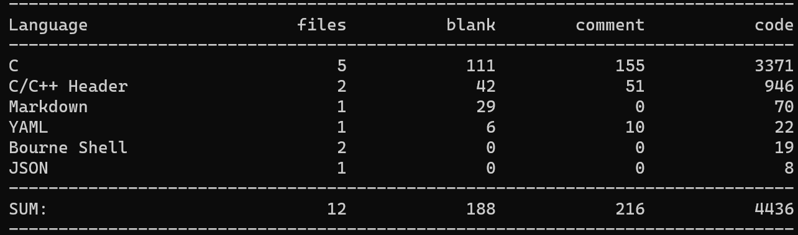
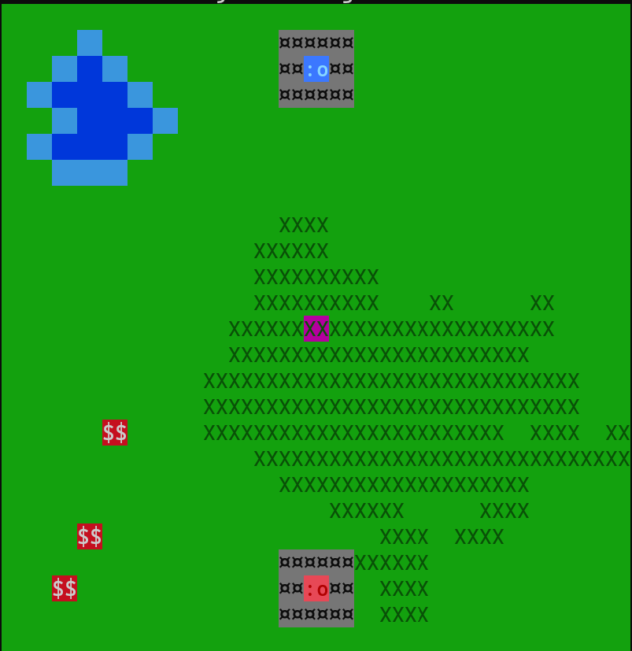
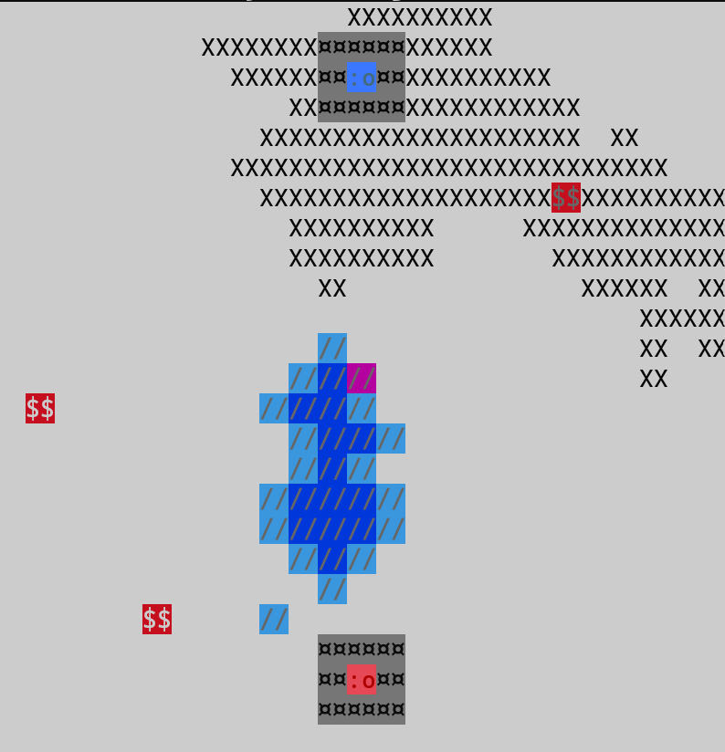
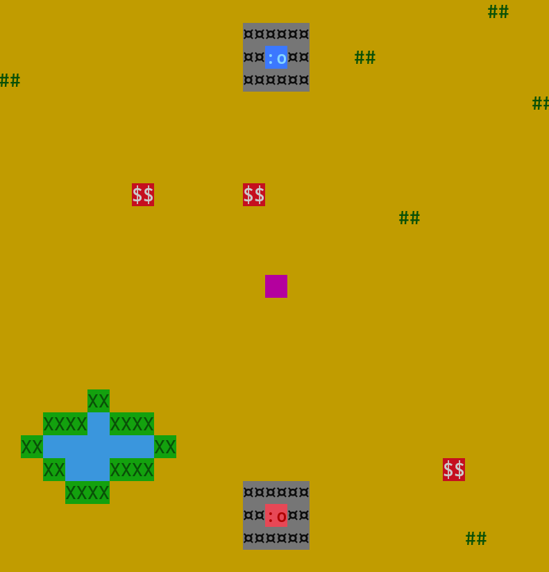
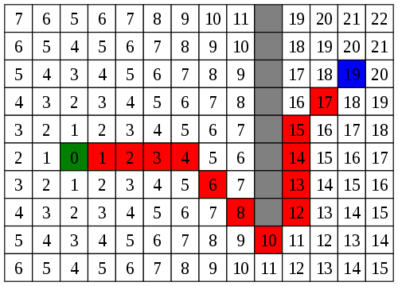

[](https://github.com/OscarLahaie/Terminations/actions/workflows/main.yml)

# Terminations
Projet n°3 d'informatique de la classe de MP2I 2021-2022 du lycée Carnot, Dijon.

#### Groupe composé de :
- LAMATY Cassandre <[@CassandreLAMATY](https://github.com/CassandreLAMATY)> 
- LAHAIE Oscar <[@OscarLahaie](https://github.com/OscarLahaie)>
- FOULON Valentin <[@srgoti](https://github.com/srgoti)>

## À propos
Il s'agit d'un jeu dans le style de Clash Royale / Civilisation mais remanié de façon à être jouable dans le terminal et avec des fonctionnalités simplifiées.
En prime, plusieurs mini-jeux développés par [@srgoti](https://github.com/srgoti) sont disponibles.



#### Les mini-jeux comprennent :
De FOULON Valentin <[@srgoti](https://github.com/srgoti)>
- Le démineur
- Les échecs
- Le jeu de la vie

## Comment compiler
Pour compiler tous les fichiers
```bash
./build.sh
```
Ou pour avoir le résultat instantanément du jeu principal
```bash
./play.sh
```
## Comment jouer ?

L'objectif du jeu est de détruire la base adversaise. Pour y parvenir le joueur dans envoyer ses unités dans le camp adverse. Pour agrandir son armée il faudra récolter des point syboliser par $$ qui apparaissent pendant la partie sur la carte. Avec ces point il possible de faire appaitre une unité dans sa base (chateau). Le joueur peut atteindre les points d'interets en déplaçant ses unités.
Pour infliger des dégat à la base adverse il faut placer une unité sur le coeur de la base ennemie.
Chaque tour l'unité infligera un point de dégat à la base adverse mais elle se décomposera aussi.
En effet les unités on un type qui se caractérise par la puissance et leur vitesse. Ces types vont de 1 à 6 et leur affichage et différent pour chaque type. Pour augmenter le type d'une unité, il suffit de combiner deux unités de même type. 
Plus les unités sont de types élevés plus elles résistent à l'affrontement car les unités des deux équipes peuvent combattre et le gagnant est forcement l'unité de type plus élevé.

## Contrôles

- p pour play et skip le paramétrage au début du jeu (facilité permettant d'aller plus rapidement au lancement du jeu) ;
- q pour quitter certaines parties du jeu ;
- flèches directionnelles pour déplacer le curseur ;
- m pour sélectionner un pion, le déplacer à l'aide des flèches et espace pour valider la case d'arrivée;
- t pour passer au joueur suivant ;
- b pour acheter une nouvelle unité à partir des points ;


## Compte rendu
### Origine du projet
L'objectif de ce projet était de créer un jeu en C jouable dans le terminal (donc sans interface graphique) mettant en place une utilisation poussée des tableaux.

C'était ainsi pour nous l'occasion de s'essayer à la génération procédurale à l'aide de ceux-ci. De fil en aiguille, le groupe s'est mis d'accord autour de la volontée de créer un jeu de type Clash Royal / Civilization, avec une inspiration graphique venant tout droit du jeu Dwarf fortress.

<br/>

### Fichiers principaux

Terminations comporte 3 fichiers principaux :
- main.c
- map.h
- pathfinder.h
  
### main.c
Il s'agit du fichiers coordonnant le jeu entier.
C'est ici que nous appelons toutes les fonctions et que nous attribuons les valeurs utilisées.

Ce fichier contient par exemple l'affichage du HUD (design par [@CassandreLAMATY](https://github.com/CassandreLAMATY)), et le menu mis en place par [@OscarLahaie](https://github.com/OscarLahaie) permettant plusieurs paramétrages, notamment au niveau de la taille de la map et de son biome (3 biomes étant disponibles : la plaine (biome par défaut), la tundra et le désert ; chacun des biome apporte diverses fonctionnalités d'affichage pour permettre à l'utilisateur de varier son expérience de jeu).

### map.h
Fichier header (= fichier contenant les entêtes / fonctions principales du fichier main.c afin d'en limiter la longueur et d'en accroitre la lisibilité.) contenant toutes les fonctions utiles à l'affichage de la map, donc de la génération procédurale de chaque biome, l'affichage des châteaux, des cases d'évènements etc... . Pour résumer, il contient toute la partie graphique brute du jeu hormis le HUD et le menuing.

### Exemples de cartes :

>Carte du biome Continental


>Carte du biome Toundra


>Carte du biome Désert

### pathfinder.h
Ficher header permettant de gérer les déplacement des pions et de l'IA à travers la map en esquivant les obstacles croisables en cours de route. Il convertit d'abord la map procédural en une map simplifier contituer de passages et d'obstacles. En suite le système de pathfinding et un algorythme assez 'bête'. Il étend d'abord une zone de recherche de plus en plus grande en mesurant la distance de parcours au fur à mesure. Une fois le point trouvé s'il est trouvé, on part de l'arrivée et on suit les plus petites valeurs jusqu'au départ.



<br/>

## Conclusion

Nous avons donc pu créer un jeu permettant l'affrontement entre deux équipes et la défense des châteaux respectifs tout en mettant en place une génération procédurale sur plusieurs biomes, comprenant par exemple la génération de montagnes, de forêts et de lacs faisant obstacle au déplacement des pions. 

Les difficultés résidaient majoritairement dans la gestion des tableaux en eux mêmes, et parfois dans le fait de déceler des erreurs qui ne sont pas forcément loggées correctement par le terminal lors de crash. Ce projet nous a permis d'approfondir nos connaissances sur les tableaux, notamment avec le pathfinder.

De plus, nous avons pu de nouveau utiliser GitHub pour ce projet, nous permettant ainsi d'améliorer notre utilisation du logiciel et notre aisance vis-à-vis de celui-ci.

<br/>

Des mises à jours seront éventuellement disponibles plus tard afin d'améliorer la qualité du jeu et des actions possibles.
